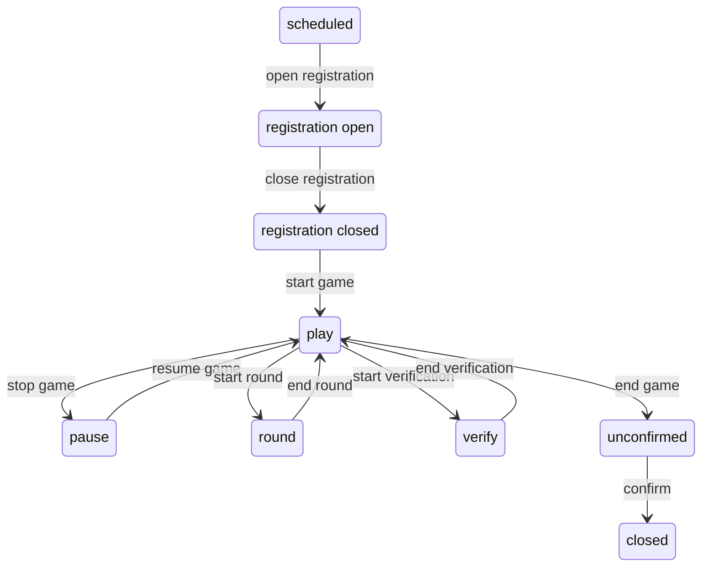

# Global specification

## Базовые определения

`game` - эвент клуба интелектуальных игр МИСИС.

`state` - состояние объекта `game`.

`event` - "стрелка" в графе состояний объекта `game`

### Возможные состояния

- before:
  - `scheduled`
  - `registration open`
  - `registration closed`
- in progress:
  - `play` - дефолтное состояние игры, когда ведущий шутейку шутит или правила рассказывает.
  - `pause` - перерыв на обед
  - `round` - внимание, вопрос!
  - `verify` - время аппеляций
- after:
  - `unconfirmed` - проверка результатов
  - `closed` - игра завершена! поздравляю, товарищи!

### Определение эвентов

- `open registration`: `scheduled` -> `registration open`
- `close registration`: `registration open` -> `registration closed`
- `start game`: `registration closed` -> `play`
- `stop game`: `play` -> `pause`
- `resume game`: `pause` -> `play`
- `start round`: `play` -> `round`
- `end round`: `round` -> `play`
- `start verification`: `play` -> `verify`
- `end verification`: `verify` -> `play`
- `end game`: `play` -> `unconfirmed`
- `confirm`: `unconfirmed` -> `closed`

### Граф состояний



### Game components

```golang
struct Member {
  id int
  commands map[Command.id, Command*]
}

struct Command {
  id int
  members map[Member.id, Member*]
}

func attach_member(command Command*, member Member*);
func remove_member(command Command*, member Memebr.id);

interface Problem {
  situation object
}

struct Round {
  problems list[Problem]
  representation object
}

func create_problem(situation object, round Round*);

struct Game {
  commands map[Command.id, Command*]
  rounds list[Round]
  points map[commands x rounds, unsigned integer]
}

func register_command(game Game*, command Command*);
func unregister_command(game Game*, command Command*);
func create_round(game Game*, represenation object);
func set_points(game Game*, round iterator, command Command*, points unsigned integer);

interface GameStateMachine {
  game Game
  state enum[game states]
}

func game_event(event enum[game events])

struct Global {
  members list[Member]
  commands list[Command]
  games list[GameStateMachine]
}

func create_member();
func create_command();
func create_game();
```

## Components

### Global

- `data storage` - микросервис, хранящий информацию о зарегистрированных пользователях и командах, а также об анонсах и прошедших играх.
- `website` - веб интерфейс к data storage.

### Game

- `game server` - микросервис, владеющий состоянием игры.
- `game master` - клиент, упраляющий ходом игры.
- `validator` - клиент, проверяющий и вносящий ответы.
- `presenter` - клиент, отображающий текущее состояние игры и ее компонентах.
